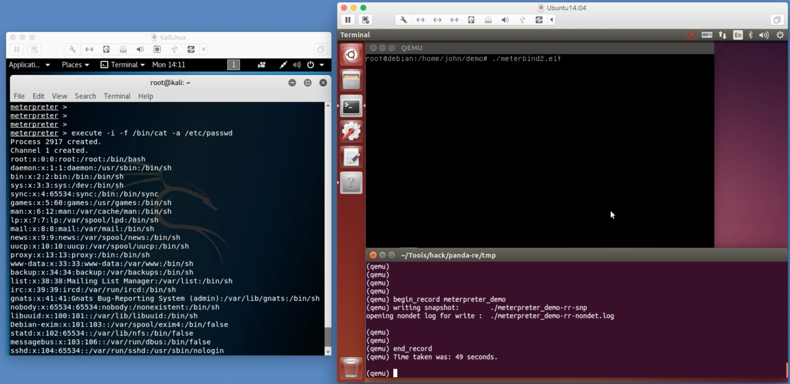
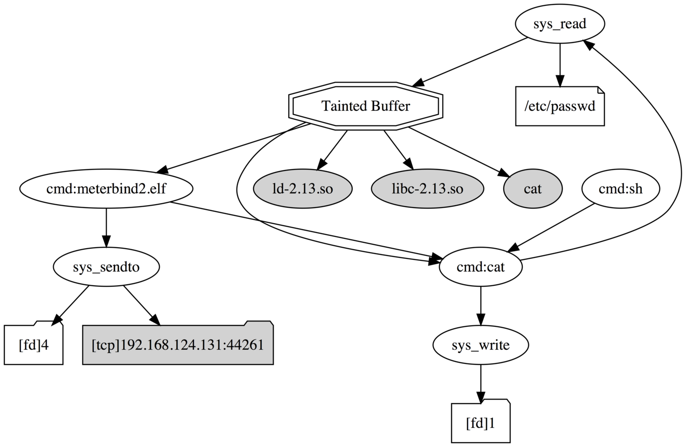

# PANDA plugin: spaniel

Summary
-------
Spaniel is a plugin for [PANDA](https://github.com/panda-re/panda).

By specifying the filenames that are compromised by an attacker, spaniel can trace every instruction which is (potentially) handled by a malware. These automated analyses are based on taint analysis.

I used `taint2`, `osi_linux`, `osi` that are plugins for taint analysis and introspection functions that are default-installed in PANDA.

Set up
-------

First, build PANDA I used.
I added little modification to the original code of PANDA. I inserted rr callback functions that handle received and/or sent packets in e1000 virtual network device.

Please apply the patch `panda-patch.patch` as follows.
After applied the patch, [build PANDA](https://github.com/panda-re/panda). 
(The platform I used is ubuntu14.04.)

    % git clone https://github.com/panda-re/panda.git
    % cd panda
    % git checkout -b 4e639ff4d867db6c485647773732bd38a316b9d6
    % patch -p1 < ../panda-patch.patch
    % cd ..
    % mkdir build-panda
    % cd build-panda/
    % ../panda/build.sh

Next, put the folder `spaniel` into the directory `panda/plugins`. And then, edit the `config.llvm.panda` to append the name of a plugin to build, namely spaniel.

    % cd ../panda/panda/plugins/
    % mv spaniel panda/plugins
    % cd panda/plugins/
    % echo "spaniel" >> config.llvm.panda
    
Finally, build Spaniel.
    
    % cd ../../../build-panda/
    % make -j 2

Arguments
---------
The arguments names are derived from `file_taint` a default-installed plugin of [PANDA](https://github.com/panda-re/panda).

* `filename`: string, filename we want to monitor and analyze by using taint analysis.
* `file_taint`: boolean, Enable taint analysis on data.
* `last_tainted_rr`: uint64, The timing (the count of rr instruction) at which taint tracking will stop.

Dependencies
------------
I modified the source code of [PANDA](https://github.com/panda-re/panda) by inserting rr callback functions that handle received and/or sent packets in e1000 virtual network device.

Use case
-------

This demo can be seen in this [video link](https://youtu.be/HibJrxdUUvg).

Data exfiltration analysis: on the left we have the attacker (Kali Linux), on the right, the victim (Debian on QEMU).

I want to analyze malcious processing applied to 'passwd'.

	$PANDA_PATH/i386-softmmu/qemu-system-i386 -m 128 -replay meterbind_cat_1211_4  -os linux-32 -panda osi\
    -panda osi_linux:kconf_group=debian-3.2.81-686-pae:32  -panda syscalls2:profile=linux_x86 \
    -panda spaniel:filename=passwd,file_taint,last_tainted_rr=3194324

And you will see this dot script in spaniel's output:

    digraph taintgraph {
        "/etc/passwd"[shape=note];
        "Tainted Buffer"[shape=doubleoctagon];
        "[fd]1"[shape=folder];
        "[fd]4"[shape=folder];
        "[tcp]192.168.124.131:44261"[shape=folder][style=filled];
        "cat"[style=filled];
        "cmd:cat";
        "cmd:meterbind2.elf";
        "cmd:sh";
        "ld-2.13.so"[style=filled];
        "libc-2.13.so"[style=filled];
        "sys_read";
        "sys_sendto";
        "sys_write";
        "Tainted Buffer" -> "cat";
        "Tainted Buffer" -> "cmd:cat";
        "Tainted Buffer" -> "cmd:meterbind2.elf";
        "Tainted Buffer" -> "ld-2.13.so";
        "Tainted Buffer" -> "libc-2.13.so";
        "cmd:cat" -> "sys_read";
        "cmd:cat" -> "sys_write";
        "cmd:meterbind2.elf" -> "cmd:cat";
        "cmd:meterbind2.elf" -> "sys_sendto";
        "cmd:sh" -> "cmd:cat";
        "sys_read" -> "/etc/passwd";
        "sys_read" -> "Tainted Buffer";
        "sys_sendto" -> "[fd]4";
        "sys_sendto" -> "[tcp]192.168.124.131:44261";
        "sys_write" -> "[fd]1";
    }

You can give the dot script an arbitrary name, I named it "exfiltration.dot." The corresponding graph can be generated with the following command:

	> dot -T pdf exfiltration.dot -o exfiltration.pdf

You can visualize the graph as follows:

	> open exfiltration.pdf

License
-------
GPLv2.

Publications
-------

* Shun Yonamine, Youki Kadobayashi, Daisuke Miyamoto, Yuzo Taenaka, "Towards Automated Characterization of Malware's High-level Mechanism Using Virtual Machine Introspection." 5th International Conference on Information Systems Security and Privacy (ICISSP 2019), Plague, Czech, Feb 2019. [pdf](http://www.insticc.org/Primoris/Resources/PaperPdf.ashx?idPaper=74055)

References
-------
Above graph was inspired from this paper.

* Yin, Heng, et al. "Panorama: capturing system-wide information flow for malware detection and analysis." Proceedings of the 14th ACM conference on Computer and communications security. ACM, 2007.

